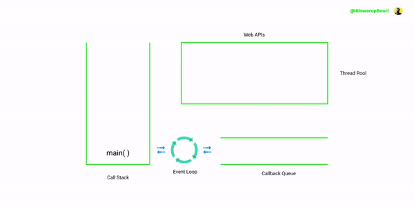
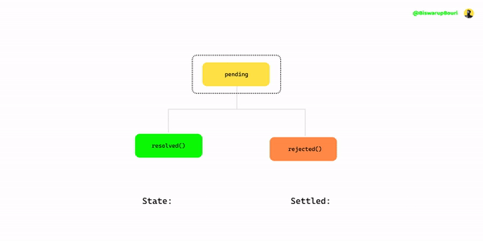

Did you know an interesting thing about JavaScript, it is synchronous and it waits for none. In JavaScript everything executes in the main thread, which means it can do one thing at a time, thus it has to execute synchronously.

It has both pros and cons - Pros: we don't have to worry about concurrency issues. Cons: we can't perform expensive operations i.e network calls. Since JavaScript is primarily designed for frontend applications we shouldn't block the main thread it will cause unresponsiveness which leads to a bad user experience.

To counter this problem JavaScript engine uses **event loop** to create an illusion of _multi-threading_ in a _single-threaded_ programming language. This is where we can perform asynchronous operations without blocking the main thread. That's the beauty of JavaScript we don't have to worry about concurrency issues and we can perform expensive operations too.

We can perform asynchronous operations using callbacks, promises and async/await. We aim to learn each of these methods to get started with asynchronous programming in JavaScript.

So without further ado, Let's get started.

## How Synchronous Programming Works in JavaScript?

Before we start, we have to pause for a moment to understand how synchronous programming works in JavaScript. To give you an idea let me take an example:

```js
const download = (file) => {
  console.log(`downloading ${file} ...`);
  return `${file}`;
};

const display = (file) => {
  console.log(`displaying ${file}`);
};

const file = download("Cat1");
display(file);

/**
downloading Cat1 ...
displaying Cat1
*/
```

In the above example, we are downloading a file and then displaying it. We are doing one task at a time. First, we have downloaded the file and then we are displaying it. But in the real world downloading a file takes time right? okay, let's simulate that:

```js {19-20}
const download = (file) => {
  console.log(`downloading ${file} ...`);
  let fileName;
  setTimeout(() => {
    console.log(`done downloading ${file}`);
    fileName = file;
  }, 500);
  return fileName;
};

const display = (file) => {
  console.log(`displaying ${file}`);
};

const file = download("Cat1");
display(file);
/*
downloading Cat1 ...
displaying undefined
done downloading Cat1
*/
```



Did you notice the execution order? `display()` function is invoked before the file has done downloading. This is because JavaScript waits for none. If you try to make JavaScript wait then the call stack will skip those functions so that it did not block the main thread. Once the JavaScript has done executing all UI related tasks then the main thread is available for handling those expensive operations. This is how the JavaScript engine maintains its synchronicity.

To make our program correct we have to use asynchronous programming.

## Asynchronous Programming With Callbacks

To make our programme correct we have to pass the `display()` function as a callback function to the download function. Okay, let's refactor our code and make it correct:

```js {20}
const download = (file, callback) => {
  console.log(`downloading ${file} ...`);
  let fileName;
  setTimeout(() => {
    console.log(`done downloading ${file}`);
    fileName = file;
    callback(fileName);
  }, 500);
  return fileName;
};

const display = (file) => {
  console.log(`displaying ${file}`);
};

const file = download("Cat1", display);
/*
downloading Cat1 ...
done downloading Cat1
displaying Cat1
*/
```

Yee congratulations now our programme works as we intended. We've successfully implemented asynchronous programming using callback in JavaScript.

Okay, it was just for a single file. What if? if we have to download and display more files, let's say 4. Okay let me refactor the code:

```js
const download = (file, callback) => {
  console.log(`downloading ${file} ...`);
  let fileName;
  setTimeout(() => {
    console.log(`done downloading ${file}`);
    fileName = file;
    callback(fileName);
  }, 500);
  return fileName;
};

const display = (file) => {
  console.log(`displaying ${file}`);
};

download("Cat1", (file) => {
  display(file);

  download("cat2", (file) => {
    display(file);

    download("cat3", (file) => {
      display(file);

      download("cat4", (file) => {
        display(file);
      });
    });
  });
});
/*
downloading Cat1 ...
done downloading Cat1
displaying Cat1     
downloading cat2 ...
done downloading cat2
displaying cat2     
downloading cat3 ...
done downloading cat3
displaying cat3     
downloading cat4 ...
done downloading cat4
displaying cat4
*/
```

The programme works fine as we intended, but the code becomes harder to maintain as the number of the file grows. The indentation goes deeper and deeper this is known as _**callback hell**_. If we try to handle errors that we can't ignore, then it will be a tedious task to do, we have to separately handle errors for each file we download. Let me show you:

```js
try {
  download("Cat1", (file) => {
    // ierror
    if (false) {
      throw new Error("ops somehing went wrong...");
    }
    display(file);

    try {
      download("cat2", (file) => {
        // errors
        if (false) {
          throw new Error("ops somehing went wrong...");
        }
        display(file);

        try {
          download("cat3", (file) => {
            // errors
            if (false) {
              throw new Error("ops somehing went wrong...");
            }
            display(file);

            try {
              download("cat4", (file) => {
                //error
                if (false) {
                  throw new Error("ops somehing went wrong...");
                }
                display(file);
              });
            } catch (error) {
              console.log(error);
            }
          });
        } catch (error) {
          console.log(error);
        }
      });
    } catch (error) {
      console.log(error);
    }
  });
} catch (error) {
  console.log(error);
}
```

Ewww it is ugly, now it is very hard to maintain the code, and will even harder as the number of indentations grows.

So, the Callback function solves the problem, but it is not ideal for more numbers asynchronous programs.

This problem is addressed in Promise, and we are going to learn it next.

## Asynchronous Programming With Promises

In JavaScript, a Promise is an object that represents the result of an asynchronous computation which we hope to receive in the future but not now.

Promises in JavaScript are much like real-world promises, let's try to understand them with an analogy.

Suppose you need some money to pay your credit bills, and your friend (Vinit) is promised you to land some money once he got it from his other friend(Rahul).

So Vinit got his money from Rahul, and then Vinit land you that money, and that's how Vinit kept his promise.

The JavaScript promise works the same way - A JavaScript promise has three states:

- **Pending:** You don't know if Vinit going to land you some money.
- **Fulfilled:** Vinit kept his promise and land you some money.
- **Rejected:** Vinit didn't get his money from Rahul so he is unable to keep his promise.

When a promise returns a state either fulfilled or Rejected it cannot be changed. For example, if a promise returns a state fulfilled it cannot be changed to _rejected state_ or vice versa.

Similarly, if the promise object changes its state from pending to fulfilled it cannot be undone or changed, i.e it cannot be reverted to pending state.

Once the promise changed its state from pending to either fulfilled or rejected it is said to be **settled**, _the promise is settled._



### Creating a Promise

```js {3}
let allGood = true;

let promise = new Promise((resolve, reject) => {
  if (allGood) {
    resolve("Hello, There!");
  } else {
    reject(new Error("ops empty!"));
  }
});
```

The `Promise` constructor accepts a callback function as an argument which is known as `executer` that is used to initialize the promise.

This callback is passed with two callback functions as arguments:

- **resolve** this callback is used to resolve the promise with a value or the result of another promise.
- **reject** this callback is used to reject the promise with a provided reason or error.

Okay now, let's receive the value from the Promise object.

```js
promise.then(onFullfilled, onRejected);
```

To get the value from the `promise` object we have to invoke the `.then()` method. This method also receives two callback functions as arguments:

- **onFulfilled** this callback function executes when the promise is _**resolved.**_

  ```js
  const onFullfilled = (val) => {
    console.log(val);
  };
  /*
  Hello, There!
  */
  ```

  the `onFulfilled` callback receives a parameter `value` which is the **value** returned from the promise object.

- **onRejected** this callback function executes when the promise is rejected.
  ```js
  const onRejected = (reason) => {
    console.log(reason);
  };
  ```
  the `onRejected` callback also receives a parameter `reason` which is the reason the promise was rejected or the errors.

Let's put the pieces together:

```js
let allGood = true;

let promise = new Promise((resolve, reject) => {
  if (allGood) {
    resolve("Hello, There!");
  } else {
    reject(new Error("ops empty!"));
  }
});

const onFullfilled = (val) => {
  console.log(val);
};

const onRejected = (reson) => {
  console.log(reson);
};

promise.then(onFullfilled, onRejected);
```

Passing two callback functions as arguments does not make sense right? Yes! `promise` object gives us another method `.catch()`. This method is specially made for handling errors return by the `promise` object.

```js
promise.then(onFullfilled).catch(onRejected);
```

There is nothing special in the `.catch()` method it is actually `.then(null, onRejected)`. So that's all about the Promise.

Now let's get back to the problem we are solving - We end up in callback hell when we try to solve our problem with multiple asynchronous callback functions. Let's try to solve this problem with Promise.

```js
const download = (file) => {
  return new Promise((resolve, reject) => {
    console.log(`downloading ${file}`);
    setTimeout(() => {
      if (true) {
        console.log(`done downloading ${file}`);
        resolve(file);
      } else {
        reject("ops someting went wrong");
      }
    }, 500);
  });
};

const display = (file) => {
  console.log(`displaying ${file}`);
};
```

So, we refactor the code with Promise based implementation. Now, let's receive the downloaded image and display it synchronously.

```js
download("dog1")
  .then((file) => display(file))
  .catch((reason) => console.log(reason));
```

Humm... that's interesting it feels like we are writing plain English. First, download the image then display the image.

All right! this was just for a single file, what if? if we have to download 4 files in the exact synchronous order? Well, we can chain promises let me show you what I mean:

```js
download("dog1")
  .then((file) => {
    if (false) {
      throw new Error("ohh an error");
    }
    display(file);
    return download("dog2");
  })
  .then((file) => {
    if (false) {
      throw new Error("ohh an error");
    }
    display(file);
    return download("dog3");
  })
  .then((file) => {
    if (false) {
      throw new Error("ohh an error");
    }
    display(file);
    return download("dog4");
  })
  .then((file) => {
    if (false) {
      throw new Error("ohh an error");
    }
    display(file);
  })
  .catch((reason) => console.log(reason));
/*
downloading dog1
done downloading dog1
displaying dog1
downloading dog2
done downloading dog2
displaying dog2
downloading dog3
done downloading dog3
displaying dog3
downloading dog4
done downloading dog4
displaying dog4
  */
```

So, we are returning the promise object and receiving its value in the next `.then()` block. The syntax looks better than callback hell, it's also easier to handle errors. This is how we escape from callback hell by using Promise.

It is even easier if our downloading files are not dependent on each other, we can resolve promises asynchronously. Let me show you:

```js
Promise.all([
  download("dog1"),
  download("dog2"),
  download("dog3"),
  download("dog4"),
])
  .then((files) => {
    files.forEach((file) => display(file));
  })
  .catch((reason) => console.log(reason));
/*
downloading dog1
downloading dog2
downloading dog3
downloading dog4
done downloading dog1
done downloading dog2
done downloading dog3
done downloading dog4
displaying dog1
displaying dog2
displaying dog3
displaying dog4
  */
```

Okay, Promise made asynchronous programming easy but still it uses callbacks. In ES2017 async/await were introduced to make this process even easier. It made the asynchronous program look like synchronous code. We are going to learn it next.

## Asynchronous Programming with Async/await

`async` and `await` keywords represent a paradigm shift in asynchronous programming in JavaScript. The keyword async/await built on top of promises, hides the complexity of promise and let you synchronously write asynchronous code, isn't it awesome? Hell yeah! it's awesome...

### The `async` Keyword

This keyword lets you define an asynchronous function that returns a promise by default. Let me show you an example:

```js
const greet = async (msg) => {
  return msg;
};

greet("Hello")
  .then((msg) => console.log(msg))
  .catch((reason) => console.log(reason));

/*
Hello
*/
```

Awesome right? it hides the complexity of defining a promise, and still, it returns a promise. To explicitly say the async function return `Promise.resolve()` by default, async/await is syntactic sugar under the hood it is the promise object.

The `async` function not only make asynchronous programming easy but also made handling errors even easier. Let me give you an example:

```js
const getDrink = async (age) => {
  try {
    if (age > 18) {
      return Promise.resolve("Whisky");
    } else {
      throw new Error("Oh Boy Whisky is not for kids");
    }
  } catch (error) {
    return Promise.reject(error);
  }
};

getDrink(15)
  .then((val) => console.log(val))
  .catch((reason) => console.log(reason));

/*
Error: Oh Boy Whisky is not for kids
*/
```

So, the `async` keyword is placed before the function declaration to make or mark a function as an asynchronous function.

### The `await` keyword

Inside a function that is marked as async, you are allowed to place the `await` keyword in front of an expression that returns a promise. The `await` keyword pause the execution of the async function until the promise is settled.

Let me show you an example:

```js
const myDrink = async (age) => {
  try {
    const drink = await getDrink(age);

    console.log(drink);
  } catch (error) {
    console.log(error);
  }
};

myDrink(25);
/*
Whisky
*/
```

:::note
In ES2021 we can use top-level await:

```js
const drink = await getDrink(25).catch((err) => console.log(err));
console.log(drink);
```

:::

The `await` keyword must be placed in front of an expression that returns a promise. That's how we consume promise inside an async function.

Okay, that's enough intro for async/await let's solve the problem we are dealing with when using plain promise.

Let me refactor the code with the async function:

```js {2}
const download = (file) => {
  return new Promise((resolve, reject) => {
    console.log(`downloading ${file}`);
    setTimeout(() => {
      if (true) {
        console.log(`done downloading ${file}`);
        resolve(file);
      } else {
        reject("ops someting went wrong");
      }
    }, 500);
  });
};

const display = (file) => {
  console.log(`displaying ${file}`);
};
```

since our `download()` function returns a promise it didn't need refactoring.

let's consume promise inside the async function:

```js {3}
const displayFile = async () => {
  try {
    const file = await download("cat");
    display(file);
  } catch (error) {
    console.log(error);
  }
};

displayFile();
/*
downloading cat
done downloading cat
displaying cat
*/
```

Congratulations you just wrote an asynchronous program with synchronous code.

Did you notice? this code is looking similar to the synchronous code we wrote a few moments ago. But there we got the wrong order of execution our program was trying to display the file even before the file has done downloaded.

Here, with async/await it got the right execution order of our code. We wrote an asynchronous program that looks like asynchronous code.

Okay, it was for just one file, now lets download 4 files in synchronous order:

```js
const displayFile = async () => {
  try {
    const file1 = await download("cat1");
    display(file1);
    const file2 = await download("cat2");
    display(file2);
    const file3 = await download("cat3");
    display(file3);
    const file4 = await download("cat4");
    display(file4);
  } catch (error) {
    console.log(error);
  }
};

displayFile();
/*
downloading cat1
done downloading cat1
displaying cat1
downloading cat2
done downloading cat2
displaying cat2
downloading cat3
done downloading cat3
displaying cat3
downloading cat4
done downloading cat4
displaying cat4
*/
```

That's it, no more bad indentations i.e callback hell, no callbacks and the `.then()` method, it's just a pure asynchronous program written in synchronous code.

:::note
Then next `await` will not be executed until the previous `await` finishes its job.
:::

### Asynchronous Iteration with for/await loop (Bonus)

If our files were not dependent on each other we can download and display them asynchronously:

```js
const displayFiles = async () => {
  try {
    const files = [
      download("dog1"),
      download("dog2"),
      download("dog3"),
      download("dog4"),
    ];

    for await (let file of files) {
      display(file);
    }
  } catch (error) {
    console.log(error);
  }
};

displayFiles();
/*
downloading dog1
downloading dog2
downloading dog3
downloading dog4
done downloading dog1
displaying dog1
done downloading dog2
displaying dog2
done downloading dog3
displaying dog3
done downloading dog4
displaying dog4
*/
```

## Summary

- We can code asynchronous programs with plain callbacks. But it's not well suited for asynchronous programming, you might end up callback hell and handling errors will be so tough.

- Promise is well suited for asynchronous programming because it returns a value that we hope to receive in future but not now.

  Promise has three states:

  - Pending
  - Fullfilled
  - Rejected

  When a promise is resolved or rejected it is said to be settled and the state of promise cannot be changed.
  We can chain promise with the `.then()` method to the desired length synchronously.

  In promise still, we have to use callback functions to perform our asynchronous operations.

- Async/await keywords represents a paradigm shift in asynchronous programming in JavaScript. These keywords are built on top of the Promise object to make promises enjoyable in JavaScript.
